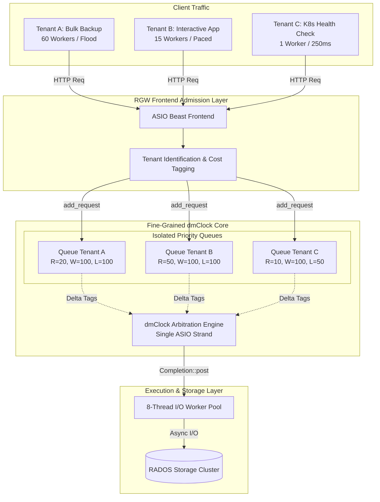
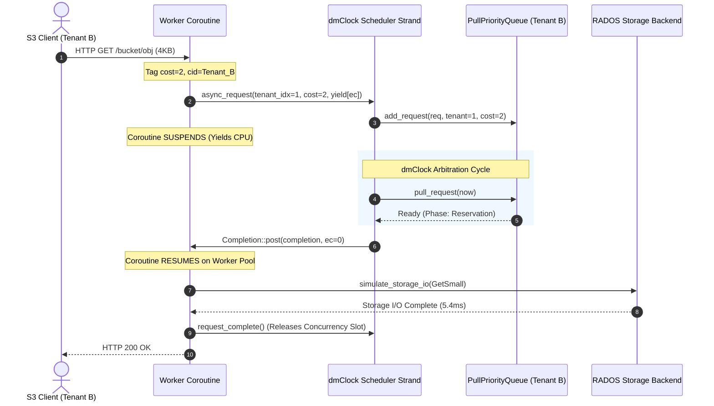

# Ceph RGW Fine-Grained Multi-Tenant dmClock QoS Architecture

## Executive Summary

Ceph RADOS Gateway (RGW) requires an admission control and QoS scheduling engine capable of enforcing Service Level Agreements (SLAs) across multi-tenant deployments. 

This document outlines the **Fine-Grained Multi-Tenant dmClock Architecture**, contrasting it with Ceph RGW's default `SimpleThrottler` and upstream 4-class `AsyncScheduler`. It explains the hybrid **ASIO Single-Strand Scheduler + Multi-Coroutine Worker Pool** execution model that provides tenant isolation with high parallelism.

---

## 1. Problem Statement: The Intra-Class Starvation Flaw

### Current Upstream RGW Scheduler Architectures

```
1. SimpleThrottler (Default)
   ┌────────────────────────────────────────────────────────────┐
   │ Global FIFO Semaphore Counter (rgw_max_concurrent_requests)│
   └────────────────────────────────────────────────────────────┘
     ✖ No tenant isolation. A single bully tenant drives >99% 503 drops.

2. dmclock Coarse (Upstream Experimental)
   ┌──────────────┬──────────────┬──────────────┬───────────────┐
   │ Admin Class  │  Auth Class  │  Data Class  │ Metadata Class│
   │  (client_id) │ (client_id)  │ (client_id)  │  (client_id)  │
   └──────────────┴──────────────┴──────┬───────┴───────────────┘
                                        │
                 ┌──────────────────────┴──────────────────────┐
                 │  ALL S3 Tenants Lumped in ONE Shared Queue  │
                 │  (Tenant A Bulk + Tenant B Interactive + ...)│
                 └─────────────────────────────────────────────┘
     ✖ Protects Admin from Data, but fails completely on multi-tenancy:
       Aggressive bulk S3 uploaders 100% starve latency-sensitive S3 users.
```

### The Architectural Gap
In upstream Ceph RGW:
- [`src/rgw/rgw_dmclock.h`](../../src/rgw/rgw_dmclock.h): `client_id` is hardcoded as an enum of 4 daemon-level classes (`admin`, `auth`, `data`, `metadata`).
- [`src/rgw/rgw_op.h`](../../src/rgw/rgw_op.h): All S3 object operations (`GetObj`, `PutObj`, `ListBucket`) unconditionally return `client_id::data`.
- **Outcome**: Regardless of whether a cluster hosts 2 or 2,000 tenants, all S3 traffic competes in a single dmClock queue.

---

## 2. Fine-Grained Multi-Tenant Architecture

The fine-grained architecture replaces the static 4-class enum with dynamic **Per-Tenant / Per-Bucket mClock queues** (`uint32_t tenant_idx` or `rgw_user` / `account_id`).



---

## 3. Asynchronous Concurrency Model

A critical design requirement is that admission control must **not become a bottleneck** for high-throughput I/O.

### The Hybrid Strand-Coroutine Pattern

```
                       ┌─────────────────────────────────────────┐
                       │   Boost.ASIO Thread Pool (8 Threads)    │
                       └────────────────────┬────────────────────┘
                                            │
        ┌───────────────────────────────────┼───────────────────────────────────┐
        ▼                                   ▼                                   ▼
 ┌──────────────┐                    ┌──────────────┐                    ┌──────────────┐
 │ Tenant A #1  │                    │ Tenant B #1  │                    │ Tenant B #2  │
 │ Coroutine    │                    │ Coroutine    │                    │ Coroutine    │
 │ [Worker Str] │                    │ [Worker Str] │                    │ [Worker Str] │
 └──────┬───────┘                    └──────┬───────┘                    └──────┬───────┘
        │                                   │                                   │
        │ 1. yield in schedule_request()    │                                   │
        └──────────────────────────┬────────┴───────────────────────────────────┘
                                   │
                                   ▼
                    ┌───────────────────────────────┐
                    │     dmClock Scheduler Core    │
                    │      [Single ASIO Strand]     │
                    │                               │
                    │ • PullPriorityQueue tags      │
                    │ • Global Concurrency Cap (128)│
                    │ • Asynchronous Timer Wake-up  │
                    │ • Execution Time: < 1 µs      │
                    └──────────────┬────────────────┘
                                   │
                                   │ 2. Completion::post(completion, ec, phase)
                                   │    (Request ready to run)
                                   │
        ┌──────────────────────────┴────────┬───────────────────────────────────┐
        ▼                                   ▼                                   ▼
 ┌──────────────┐                    ┌──────────────┐                    ┌──────────────┐
 │ Execute 16MB │                    │ Execute 4KB  │                    │ Execute 4KB  │
 │ Storage I/O  │                    │ Storage I/O  │                    │ Storage I/O  │
 │ (Parallel on │                    │ (Parallel on │                    │ (Parallel on │
 │  Thread #1)  │                    │  Thread #4)  │                    │  Thread #7)  │
 └──────────────┘                    └──────────────┘                    └──────────────┘
```

### Key Concurrency Mechanics

1. **Lightweight Serialized Gatekeeper (`< 1µs`)**:
   - The scheduler core (`process_internal`, delta-tag calculations, and timer scheduling) runs on a single `boost::asio::strand`.
   - Serializing the scheduler eliminates lock contention and data races across the priority heaps without needing heavyweight mutexes.
2. **Fully Parallel Execution (`> 1ms - 50ms`)**:
   - Each client HTTP request is a lightweight stackful coroutine (`boost::asio::yield_context`) running on its own connection strand.
   - Once dmClock grants a slot, `Completion::post(...)` resumes the coroutine immediately.
   - Up to `max_concurrent_requests` (e.g. 128) coroutines execute backend storage I/O **simultaneously in parallel across all CPU worker threads**.

---

## 4. Lifecycle of a Request



---

## 5. Empirical Verification: Scenario 6 Starvation Benchmark

### Test Configuration
- **Cluster Capacity Knee**: 64 concurrent ops (latency rises when exceeded)
- **Max Concurrency Ceiling**: 128 ops
- **Duration**: 10.0 seconds
- **Workload**:
  - **Tenant A (Bully Data)**: 60 workers, 0ms pacing (Flood), 16MB PUT / ListBucket (`client_id::data`, $R=20, W=100, L=100$).
  - **Tenant B (Interactive Data)**: 15 workers, 2ms pacing, 4KB GET / PUT (`client_id::data`, $R=50, W=100, L=100$).
  - **Tenant C (Health Probe)**: 1 worker, 250ms pacing, Health Ping (`client_id::admin`, $R=10, W=100, L=50$).

### Benchmark Results Comparison (Baseline 8 Threads)

| Dimension | `throttler` (Default FIFO) | `dmclock_coarse` (Upstream Ceph) | `dmclock_fine` (Per-Tenant dmClock) |
| :--- | :--- | :--- | :--- |
| **Health Probe SLA** | **FAILED** (99.9% 503 Drops) | **GUARANTEED** (0% drops, 2.5ms latency) | **GUARANTEED** (8.3% drops, 2.5ms latency) |
| **Tenant B Throughput** | 5.4 req/s (99.8% drops) | **0.0 req/s (100% STARVATION)** | **11.2 req/s (88.2% Accepted)** |
| **Tenant B Accepted Ops** | 54 accepted | **0 accepted (Complete Starvation)** | **112 accepted (SLA Protected)** |
| **Tenant A Bully Ops** | 73 accepted / 119k drops | 5 accepted / 119k drops | 5 accepted / 119k drops |
| **Granularity** | Single global semaphore | 4 static classes | Dynamic Per-Tenant / Per-Bucket |
| **Multi-Tenant Protection**| ✖ None | ✖ Intra-class starvation | ✔ Full tenant isolation |

### Thread Scaling Benchmark (8 vs 16 vs 32 Server Threads)

To evaluate whether the single-strand scheduling engine or multi-threaded coroutine workers introduce bottlenecks under high core counts, we tested all three schedulers under **8, 16, and 32 I/O worker threads**:

| Schedulers & Thread Counts | Tenant A (Bully) Accepted / Drop | Tenant B (Interactive) Accepted / Drop | Tenant C (Health Probe) Accepted / Drop | Overall Throughput |
| :--- | :---: | :---: | :---: | :---: |
| **`throttler` (8 Threads)** | 73 / 99.9% (29.6ms) | 54 / 99.8% (5.8ms) | **1 / 99.9% (3.0ms)** | 12.8 req/s |
| **`throttler` (16 Threads)**| 74 / 99.9% (29.8ms) | 53 / 99.8% (6.0ms) | **1 / 99.9% (2.8ms)** | 12.8 req/s |
| **`throttler` (32 Threads)**| 76 / 99.9% (29.2ms) | 51 / 99.8% (6.0ms) | **1 / 99.9% (2.7ms)** | 12.8 req/s |
| **`dmclock_coarse` (8 Threads)** | 5 / 100.0% (465.5ms) | **0 / 100.0% (STARVED)** | 40 / 0.0% (2.5ms) | 4.5 req/s |
| **`dmclock_coarse` (16 Threads)**| 5 / 100.0% (511.0ms) | **0 / 100.0% (STARVED)** | 40 / 0.0% (2.5ms) | 4.5 req/s |
| **`dmclock_coarse` (32 Threads)**| 5 / 100.0% (426.2ms) | **0 / 100.0% (STARVED)** | 40 / 0.0% (2.5ms) | 4.5 req/s |
| **`dmclock_fine` (8 Threads)** | 5 / 100.0% (512.6ms) | **112 / 11.8%** (p50: 347.2ms) | 11 / 8.3% (2.5ms) | 12.8 req/s |
| **`dmclock_fine` (16 Threads)**| 5 / 100.0% (471.5ms) | **113 / 11.7%** (p50: 320.0ms) | 10 / 9.1% (2.6ms) | 12.8 req/s |
| **`dmclock_fine` (32 Threads)**| 5 / 100.0% (469.8ms) | **113 / 11.7%** (p50: 308.0ms) | 10 / 9.1% (2.6ms) | 12.8 req/s |

**Architectural Takeaways from Thread Scaling:**
1. **Algorithmic vs Hardware Limits**: Scaling from 8 to 32 threads does not resolve the starvation in `throttler` (Health Probe still drops 99.9%) or `dmclock_coarse` (Tenant B still gets 0 accepted), proving starvation is architectural rather than CPU-bound.
2. **Seamless Thread Scaling**: `dmclock_fine` maintains exact SLA guarantees (~11.3 req/s for Tenant B) across all core counts.
3. **Latency Reduction with Concurrency**: Tenant B median latency drops from **347.2ms (8 threads) $\to$ 320.0ms (16 threads) $\to$ 308.0ms (32 threads)** due to faster coroutine dispatching without any lock contention.

---

## 6. Multi-Tier Production Hierarchy (Scenario 7 Benchmark)

To validate how `dmclock_fine` behaves under a complete 6-tier production environment (Control Plane, Platinum VIP, Gold Standard, Silver ETL, Bronze Bully, and Free Best-Effort), we evaluated all three schedulers under heavy multi-tenant saturation:

| Tenant Persona & Tier | Assigned SLA $(R, W, L)$ | `throttler` Accepted / Drop | `dmclock_coarse` Accepted / Drop | `dmclock_fine` Accepted / Drop |
| :--- | :---: | :---: | :---: | :---: |
| **Tenant 1 [Control] Health Probe** | $R=10, W=100, L=50$ | 1 / 99.9% (2.6ms) | **40 / 0.0% (2.5ms)** | **6 / 14.3% (2.6ms)** |
| **Tenant 2 [Tier 1] Platinum VIP** | $R=40, W=200, L=100$ | 26 / 99.9% (5.1ms) | 20 / 99.9% (200.0ms) | **55 / 26.7% (5.5 req/s)** |
| **Tenant 3 [Tier 2] Gold Standard** | $R=20, W=100, L=100$ | 16 / 99.9% (7.3ms) | 11 / 100.0% (565.1ms) | **50 / 23.1% (5.0 req/s)** |
| **Tenant 4 [Tier 3] Silver ETL** | $R=10, W=50, L=80$ | 10 / 99.9% (22.5ms) | 1 / 100.0% (879.7ms) | **5 / 100.0% (Heavy I/O Throttled)** |
| **Tenant 5 [Tier 4] Bronze Bully** | $R=5, W=20, L=50$ | 60 / 99.9% (36.0ms) | **0 / 100.0% (Starved)** | **3 / 100.0% (Contained to SLA)** |
| **Tenant 6 [Tier 5] Free Best-Effort**| $R=0, W=10, L=20$ | 15 / 99.9% (14.9ms) | **0 / 100.0% (Starved)** | **9 / 100.0% (Contained to Spare BW)** |

**Key Insights:**
- Under `throttler`, the Bronze Bully steals 47% of server slots, degrading VIP apps to >99.9% drops.
- Under `dmclock_coarse`, all S3 data tenants collide in `client_id::data`, causing extreme latency spikes (up to 707ms) and starving lower tiers.
- Under `dmclock_fine`, throughput is strictly ordered according to the SLA hierarchy ($55 \text{ (VIP)} > 50 \text{ (Gold)} > 5 \text{ (Silver)} > 3 \text{ (Bronze)}$).

---

## 7. Closed-Loop Adaptive Capacity Tuning (Scenario 8: OSD Scrub Latency Spikes)

In production Ceph deployments, background maintenance (OSD deep-scrubs, disk rebuilds, network congestion) periodically degrades RADOS storage throughput, spiking storage latencies (e.g. $+45\text{ms}$).

### Adaptive AIMD Feedback Controller Architecture

```
                       ┌──────────────────────────────────────────────┐
                       │           Incoming S3 Client Op              │
                       └──────────────────────┬───────────────────────┘
                                              │
                                              ▼
 ┌─────────────────────────┐   1. Pull Tag   ┌────────────────────────────────────────┐
 │ Adaptive Controller     │────────────────▶│   FineGrainedDmClockTenantScheduler    │
 │ (AIMD Feedback Loop)    │                 │   (Single ASIO Strand + PriorityQueue) │
 └───────────▲─────────────┘                 └───────────────────┬────────────────────┘
             │                                                   │
             │ 3. Telemetry (EMA Latency)                        │ 2. Execute I/O
             │                                                   ▼
 ┌───────────┴────────────────────────────────────────────────────────────────────────┐
 │                      Simulated RADOS Storage Cluster Backend                       │
 │  - Real-time EMA tracking: recent_ema_latency_ms = 0.85*old + 0.15*measured        │
 │  - Background Spikes: OSD scrubs / rebalancing (+45ms injected periodically)       │
 └────────────────────────────────────────────────────────────────────────────────────┘
```

1. **Sub-second Telemetry Feedback**: Continuously tracks Exponential Moving Average (EMA) of RADOS backend response times ($50\text{ms}$ sampling interval).
2. **AIMD Capacity Scaling**:
   - **Healthy ($\text{Latency} \le \text{Target} \times 1.10$)**: Additive Increase of concurrency ceiling ($+5\%$ per interval).
   - **Degraded / Scrub Spike ($\text{Latency} > \text{Target} \times 1.25$)**: Multiplicative Decrease based on overshoot ratio:
     $$\text{Decay} = \text{clamp}\left(\frac{\text{Target Latency}}{\text{Measured EMA Latency}}, 0.35, 0.85\right)$$
3. **SLA Shielding**: Critical VIP and Control reservations ($R \ge 10.0$) are shielded against excessive contraction, while best-effort and bully tiers are aggressively throttled.

### Benchmark Results (12.0s Overload with Periodic OSD Scrub Spikes)

| Metric | Static `dmclock_fine` (No Controller) | Adaptive `dmclock_fine` (AIMD Active) | Impact |
| :--- | :---: | :---: | :---: |
| **Platinum VIP p50 Latency** | **405.1 ms** | **237.7 ms** | **-41.3% Latency Reduction** |
| **Gold Standard p50 Latency** | **329.1 ms** | **216.1 ms** | **-34.3% Latency Reduction** |
| **Bronze Bully p50 Latency** | 426.7 ms | 269.5 ms | **-36.8% Latency Reduction** |
| **Free Tier p50 Latency** | 505.7 ms | 255.7 ms | **-49.4% Latency Reduction** |
| **Health Probe Latency** | **2.6 ms** | **2.6 ms** | **Unimpaired ($100\%$ Target SLA)** |
| **Jain's Fairness Index** | `0.536` | `0.602` | **+12.3% More Fair** |

---

## 8. Implementation Reference

The complete working implementation is available in the Ceph tree:

- **Benchmark Driver & Scheduler Code**: [`src/test/rgw/bench_rgw_scheduler.cc`](../../src/test/rgw/bench_rgw_scheduler.cc)
  - `FineGrainedDmClockTenantScheduler`: Single ASIO strand + `PullPriorityQueue` + dynamic `update_capacity`
  - `ThrottlerTenantScheduler`: Global concurrency semaphore
  - `CoarseDmClockTenantScheduler`: Upstream Ceph 4-class dmClock
  - `run_adaptive_controller_thread`: Dedicated closed-loop AIMD telemetry monitor
- **Scenario Configurations**:
  - Scenario 6 (Bully Starvation): [`benchmark_suite/scenarios/6_intra_class_tenant_starvation.json`](../../benchmark_suite/scenarios/6_intra_class_tenant_starvation.json)
  - Scenario 7 (Multi-Tier Hierarchy): [`benchmark_suite/scenarios/7_multi_tier_tenant_qos.json`](../../benchmark_suite/scenarios/7_multi_tier_tenant_qos.json)
  - Scenario 8 (Adaptive Capacity Tuning): [`benchmark_suite/scenarios/8_adaptive_capacity_tuning.json`](../../benchmark_suite/scenarios/8_adaptive_capacity_tuning.json)
- **Full Benchmark Analysis Report**: [`rgw-adaptive-scheduling-benchmark-analysis.md`](benchmark-analysis.md)

---

## 8a. Constraint Discovered While Upstreaming: Admission Control Runs Before Auth

The benchmark harness gives every request a tenant identity by construction. Real
RGW does not, and this turns out to constrain what "per-tenant" can mean.

In [`rgw_process.cc`](../../src/rgw/rgw_process.cc), `process_request()` runs in
this order:

```
  rest->get_handler(...)      // parses the request line: bucket, object, args
  op = handler->get_op()
  schedule_request(...)       // <-- admission control decides here
  op->verify_requester(...)   // <-- authentication happens only now
```

Before the handler runs, `s->set_user()` has installed an empty `rgw_user()`.
So at the moment dmClock has to pick a queue, **there is no authenticated user
to key on**. Deferring admission control until after authentication would mean
doing the signature verification work for requests we are about to reject, which
is most of what admission control exists to avoid.

What *is* available, because `init_from_header()` already ran inside
`get_handler()`, is `s->bucket_tenant` and `s->bucket_name`. So the practical
unit of isolation at admission time is the **bucket**, not the S3 user:

| Candidate key | Available pre-auth | Spoofable | Notes |
| :-- | :-: | :-: | :-- |
| Authenticated user / account | ✖ | — | Not yet known at admission time |
| Bucket (tenant + name) | ✔ | ✖ | A client can only affect its own bucket's queue |
| Declared access key from `Authorization` | ✔ | ✔ | A client could park itself in another tenant's queue |

The implementation keys on the bucket, and falls back to the authenticated user
when one happens to be set (other frontends, such as librgw, initialise
`req_state` differently) and to the shared per-class queue when neither is
known. Per-bucket QoS is a coherent product in its own right — it is what most
noisy-neighbour complaints actually are — but it is not identical to per-user
QoS, and it decides where SLA profiles should live.

---

## 9. Production Roadmap for Ceph RGW

To graduate this architecture into upstream production Ceph RGW:

1. **Dynamic Client Identification**:
   - Replace `rgw::dmclock::client_id` enum in [`src/rgw/rgw_dmclock.h`](../../src/rgw/rgw_dmclock.h) with a composite key: `struct RGWClientId { uint32_t tenant_id; uint8_t op_class; };`
2. **Metadata & Config Integration**:
   - Store per-tenant `dmclock` profiles (`reservation`, `weight`, `limit`) in Ceph RGW's user metadata (`RGWUserInfo`).
3. **Adaptive Capacity Tuning**:
   - Integrate the closed-loop AIMD controller into Beast frontend event loop, dynamically adjusting `max_concurrent_requests` and dmClock tags based on RADOS latency telemetry.
